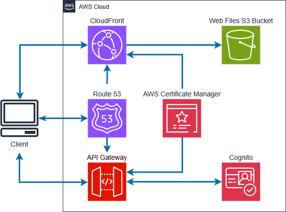

# WpwilsonSite

This project deploys a serverless single-page application (SPA) using AWS services, with Terraform managing infrastructure as code.

## Description

This project provides a low cost but high performance static website hosting solution using AWS services.

This project provisions the following AWS infrastructure using Terraform:

-   **Static Website Hosting**: Content is stored in an **Amazon S3 bucket** and served as a static website.
-   **Content Delivery Network**: **Amazon CloudFront** caches and accelerates website delivery worldwide.
-   **Secure Custom Domain**: **AWS Certificate Manager (ACM)** provides SSL/TLS encryption, and **Amazon Route 53** manages DNS (e.g., `wpwilson.com`).
-   **API Gateway for Backend Integration**: **Amazon API Gateway** routes requests to serverless services, including:
    -   [Light Schedule Service](https://github.com/wpwilson10/light-schedule-service) for smart lighting configurations.
    -   [Logging Service](https://github.com/wpwilson10/logging-service) for monitoring and logging events.

Additionally an APIGateway is provisioned which prodvides the REST API routing for other services like the [light-schedule-service](https://github.com/wpwilson10/light-schedule-service) and [logging-service](https://github.com/wpwilson10/logging-service).

This architecture aligns with AWS’s Well-Architected Framework for [serverless SPA applications](https://docs.aws.amazon.com/whitepapers/latest/serverless-multi-tier-architectures-api-gateway-lambda/single-page-application.html) by leveraging a serverless, fault-tolerant design.



## Configuration

Before deploying, create a `terraform.tfvars` file to define the necessary variables. Required variables are defined in [`variables.tf`](./terraform/variables.tf). Key configuration options include:

-   **`api_domain_prefix`** – Prefix for the API services domain (e.g., `api.example.com`).
-   **`client_file_directory`** – Path to the directory containing the website’s client files.
-   **`credentials_profile`** – AWS credentials profile for authentication.
-   **`domain_name`** – The domain name for the website.
-   **`github_repo`** – The GitHub repository managing this project.
-   **`project_name`** – Name used for tagging and organizing resources.

## Setup

### 1. Initial Deployment

If using a third-party registrar (e.g., GoDaddy, NameCheap), **update nameservers** to point to the **Route 53 hosted zone** before proceeding.

### 2. Deploy with Terraform

Run the following commands from the Terraform directory:

```sh
terraform init
terraform plan
terraform apply
```

Terraform will automatically upload **client files to S3** and configure the infrastructure.

## Usage

### Automatic File Uploads

-   The **client files** are stored in the **local directory** specified by the `client_file_directory` variable (default: `../client/dist/`).
-   On `terraform apply`, **Terraform detects changes** and automatically uploads modified files to the **S3 bucket** (`client_files_s3_bucket`).
-   Files already present and unchanged in S3 **will not be re-uploaded**, ensuring efficient updates.
-   The CloudFront cache may need to be invalidated if changes are not immediately visible.

### Invalidating CloudFront Cache

If updated files do not reflect immediately, manually invalidate the CloudFront cache:

```sh
aws cloudfront create-invalidation --distribution-id <DISTRIBUTION_ID> --paths "/*"
```
